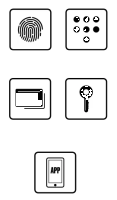

# ioBroker.wiegand-tcpip


## State, Test & Badge
[](https://www.npmjs.com/package/iobroker.wiegand-tcpip)
[](https://www.npmjs.com/package/iobroker.wiegand-tcpip)


<!-- [](https://david-dm.org/kbrausew/iobroker.wiegand-tcpip) -->

[](https://nodei.co/npm/iobroker.wiegand-tcpip/)

**Tests:** 

## **wiegand-tcpip** adapter for ioBroker
Wiegand Door Access Controller Shenzhen Weigeng Industrial

## Setup the adapter
[Setup Help](docs/setup.md)
[Release Checklist](docs/release-checklist.md)

## **Dependencies**
| Component | Version |
| :---: | :---: |
| **NodeJS** | **min 22** |
| JS-Controller | min 6.x |

## **Recognition**
My very special thanks go to **@github/uhppoted & @github/twystd** without whose help this software would not have been possible :+1:
* https://github.com/uhppoted
* https://github.com/twystd

## **Hardware**
* Wiegand to TCP/IP (https://ingenier.wordpress.com/zutrittskontrolle/  german)
* Door Access Controller Shenzhen Weigeng Industrial (http://wiegand.com.cn)
* UHPPOTE -UT0311-L01 (up to L04) (https://github.com/uhppoted)
* VBESTLIFE, Dioche, Tangxi, ... (Big marketplace :wink: )
* i-keys IK-Point SC300xNT SC90xNT? (https://www.i-keys.de)
* Secukey C1 - C4 (http://secukey.com.cn/)
* S4A ACB (http://www.s4a.com.cn/)

Not every listed hardware was tested by me. Don't hesitate to tell me about the compatibility

## **Disclaimer**
I hereby exclude liability for any damage and consequential damage that may arise from testing or using the software.
The software is designed for pure hardware-related communication.
Safety-relevant protective mechanisms are to be implemented independently in their environment

## Changelog
### 1.0.0 (2026-07-07)
* Node.js >= 22 required (Node.js 20 EOL)
* js-controller >= 6.0.11 required
* Migrated to NPM Trusted Publishing (no more classic NPM tokens)
* Migrated to ESLint 9 with `@iobroker/eslint-config`
* Added Dependabot configuration with auto-merge
* TypeScript 5.x, removed deprecated `common.materialize`
* `node:` prefix added to all built-in module imports
* Added UHPPOTE simulator based regression tests and release preflight scripts

### 0.4.7 (2024-11-05)
* Fix for ioBroker.BOT see issues
* Changes to new dependencies Node 22.x, Admin 5 and JS-Controler 5.0.19...

### 0.4.6 (2022-03-18)
* Documentation
* Translations
* Cosmetic improvements
* Fix for [Repository PR1720](https://github.com/ioBroker/ioBroker.repositories/pull/1720).

### 0.4.5 (2022-03-11)
* Bugfix: error in workflow

### 0.4.4 (2022-03-11)
* Structur Native uAPI-Framework
* user action for setTime
* setup docs

### 0.4.3
* setTime if device is running out
* add per Controller the Model (1-, 2- and 4-Doors)
* add info direction

### 0.4.2 (Beta)
* Remote network setup
* Broadcast device communication
* Remote device communication
* Bug ::Found uncleared intervals:: change clearInterval to adapter.clearInterval
* special remoteDoorOpen (in other contex change net-access-mode unmotivated to broadcast)
* device lowlevel debug enabled (from UHPPOTE framework connect to ioBroker log)
* add various "silly" log messages

### 0.4.1-beta
* Small blemishes fixed and translation completed

### 0.4.0-alpha
* First working package

Initial release

## Release preflight (step by step)
Use the full checklist in [docs/release-checklist.md](docs/release-checklist.md).
Short version:
1. Install dependencies: `npm ci`
2. Setup simulator: `npm run simulator:setup`
3. Typecheck: `npm run check`
4. Lint: `npm run lint`
5. JS + package tests: `npm test`
6. Unit tests: `npm run test:unit`
7. Integration tests: `npm run test:integration`
8. Regression tests: `npm run test:regression`
9. Verify metadata files (`README.md`, `io-package.json`, `package.json`)
10. Only release when all checks are green

## Multi-controller smoke + dev lab scripts
Use this workflow to simulate multi-controller operation with seeded cards/swipes and verify ioBroker admin availability.

Quickstart:
```bash
npm ci
npm run smoke:setup
npm run smoke:multicontroller
```

Manual setup (equivalent to `smoke:setup`):
```bash
npm run simulator:setup
npx @iobroker/dev-server setup
```

Start/Stop overview:
```bash
    # one-shot smoke run (start -> verify -> stop automatically)
    npm run smoke:multicontroller

    # user-ops multicontroller smoke (runs full simulator regression for stable user-ops coverage)
    npm run smoke:userops

    # persistent dev lab
    npm run devlab:start
    # open http://127.0.0.1:8081
    npm run devlab:stop

    # stop alias  
    npm run smoke:stop
```

Behavior notes:
1. `smoke:multicontroller` stops itself automatically.
2. `devlab:start` keeps services running until `devlab:stop` (or `smoke:stop`).
3. If a process survives due to permissions, rerun stop command in elevated PowerShell.

What is seeded by start/smoke scripts:
1. Two simulated controllers (`405419896`, `405419897`)
2. Test cards + swipe events for merge/deny/grant scenarios
3. Reachability check for the admin endpoint

## License
GPL-3.0-only

Copyright (c) 2024-2026 kbrausew <kbrausew@magenta.de>