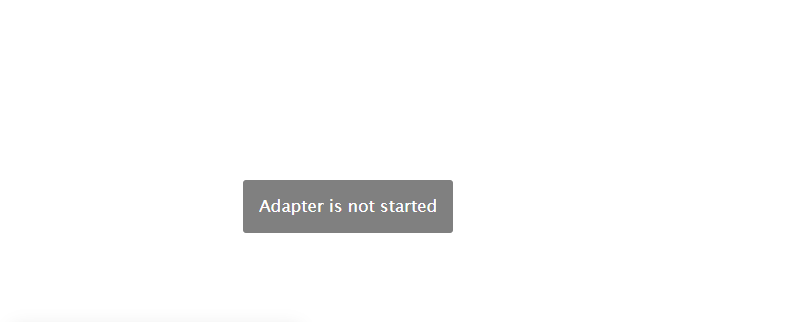

# `Setup`
- [initial start-up](#initial-start-up) Fist time access to the Device
- [Setup the adapter](#door-access-controllers-settings) Setup the ioBroker Adapter
  - [TCP/IP Network Settings](#tcpip-network-settings) Setup the adapter network

## initial start-up
When you connect the device for the first time, it may be useful to enter the network data.

These steps are optional and only required for using the device in another, remote network, outside the local network at the ioBroker instance
* To do this...
  - Connect the device to the same network in which ioBroker is also located. No Docker, VPN or other subnet [^1]
  - Install and start the adapter with default settings.
  - Switch to the "Device Remote Setup" tab
  - Run the device scan
    There are two possible error messages that result in no devices being found[^3], [^4]
  - If you have more than one device active, select the one you want in the "Device Id" dropdown box.
  - Put the desired address data in the appropriate input fields[^2]

## Door Access Controllers Settings
### TCP/IP Network Settings
#### Network interface
From the list, select the network host adapter to which you have connected your device.[^2]
- Special addresses
  - `0.0.0.0` All available interfaces (Default)
  

[^1]: If you are unable to connect the device to the same local network as the ioBroker instance,
  you must set the IP addresses in another alternative way
[^2]: The device only allows IPv4 addresses
[^3]: 
[^4]: 