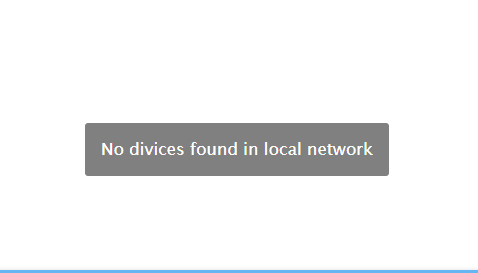

# `Setup`
- [`initial start-up`](#initial start-up) 

## `initial start-up`
When you connect the device for the first time, it may be useful to enter the network data.
* To do this...
  - Connect the device to the same network in which ioBroker is also located. No Docker, VPN or other subnet [^1]
  - Install and start the adapter with default settings.
  - Switch to the "Device Remote Setup" tab
  - Run the device scan
  - If you have more than one device active, select the one you want in the "Device Id" dropdown box.
  - Put the desired address data in the appropriate input fields[^2]
    These steps are optional and only required for using the device in another, remote network, outside the local network at the ioBroker instance

[^1]: If you are unable to connect the device to the same local network as the ioBroker instance, you must set the IP addresses in another alternative way
[^2]: The device only allows IPv4 addresses

## tbd
tbd
  